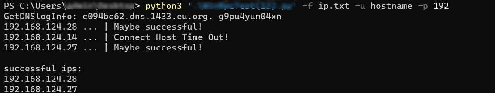

## WinRpcTest

利用RPC服务，批量探测内网Windows出网情况


Usage：

```
WinRpcTest.py [-h] [--target TARGET] [--file FILE] -u USERNAME -p PASSWORD
```

eg：

```
python WinRPCtest.py -h 192.168.101.10 -u administrator -p admin123
python WinRPCtest.py -t ips.txt -u administrator -p admin123
```




### ToDo

```
增加 nthash 和 lmhash 认证方式
```


