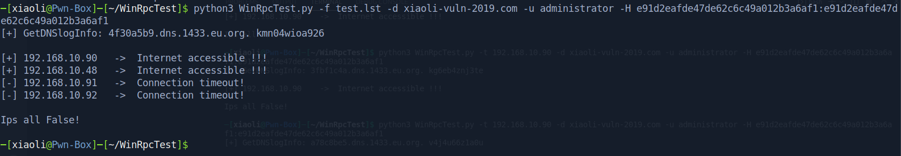

## WinRpcTest

利用RPC服务，批量探测Windows出网机器

### 前言

实战中经常碰到内网Windows机器不出网的情况，一台一台登录测出网非常麻烦，学习倾旋师傅的思路，利用Windows RPC协议进行探测，并且提到用python的impacket模块可以方便调用RPC。于是便有了此工具进行批量化探测。

### 功能

1.   批量导入IP地址，前提是有账号密码。
2.   校验失败的IP，如IP格式错误、连接超时、认证失败等情况。
3.   通过dnslog验证，获得出网ip，格式如192.168.100.101.??????.dnslog.cn，进行格式化处理并去重。

### Usage

```
WinRpcTest.py [-h] [--target/-t TARGET] [--file/-f FILE] -u USERNAME -p PASSWORD
```

单个IP

```
python WinRPCtest.py -t 192.168.101.10 -u administrator -p admin123
```

文件批量导入

```
python WinRPCtest.py -f ips.txt -u administrator -p admin123
```


-    --hashes/-H argument in order to PTH.
-    --domain/-d argument to specify the domain.

```
python3 WinRpcTest.py -f test.lst -d test.com -u administrator -H e91d2eafde47de62c6c49a012b3a6af1:e91d2eafde47de62c6c49a012b3a6af1
```




### ToDo

```
添加-o参数，将输出结果保存到文件
```


## 参考链接

https://github.com/Rvn0xsy/rvn0xsy.github.io/blob/0c31bb921398e9e2b79fb18ab8c4f6a53001ce50/content/post/2022/2022-03-04-windows-rpc.md

https://payloads.online/archivers/2022-03-04/1/

https://github.com/zeronetworks/cornershot

https://s3cur3th1ssh1t.github.io/On-how-to-access-protected-networks/

https://docs.microsoft.com/en-us/windows/win32/rpc/protocol-sequence-constants

