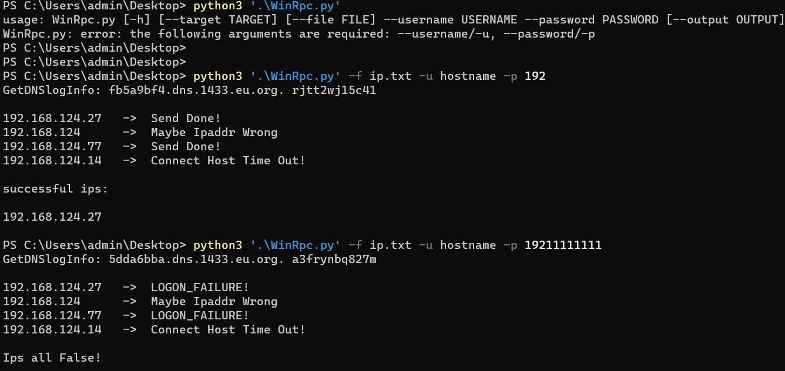

## WinRpcTest

利用RPC服务，批量探测Windows出网机器


Usage：

```
WinRpcTest.py [-h] [--target/-t TARGET] [--file/-f FILE] -u USERNAME -p PASSWORD
```

eg：

```
python WinRPCtest.py -t 192.168.101.10 -u administrator -p admin123
python WinRPCtest.py -f ips.txt -u administrator -p admin123
```




### ToDo

```
增加 nthash 和 lmhash 认证方式
```


## 参考链接

https://github.com/Rvn0xsy/rvn0xsy.github.io/blob/0c31bb921398e9e2b79fb18ab8c4f6a53001ce50/content/post/2022/2022-03-04-windows-rpc.md

https://payloads.online/archivers/2022-03-04/1/

https://github.com/zeronetworks/cornershot

https://s3cur3th1ssh1t.github.io/On-how-to-access-protected-networks/

https://docs.microsoft.com/en-us/windows/win32/rpc/protocol-sequence-constants

